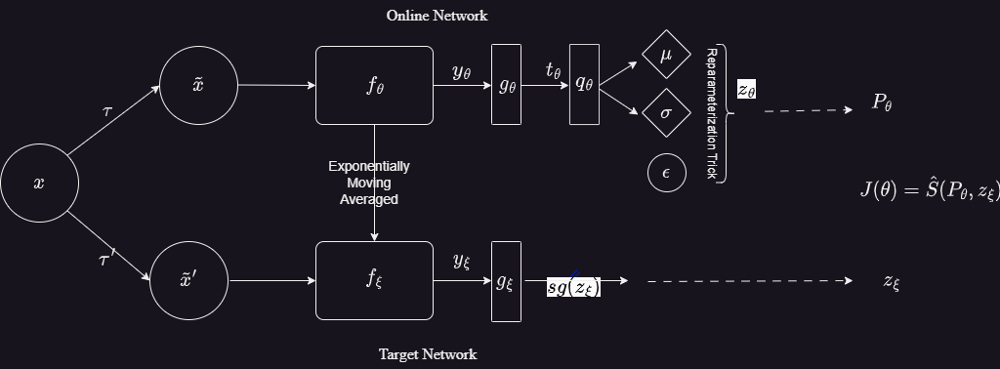

# ProSMin: Probabilistic Self-supervised Learning via Scoring Rules Minimization

This repository is for  paper. 





## Table of contents
* [Installation](#Installation)
* [Dataset](#Dataset)
* [Usage/Examples](#Usage/Examples)
* [Acknowledgements](#Acknowledgements)
* [License](#License)

### Dependency


## Installation

Install requirments:
```python
pip install -r requirements.txt
```
## Dataset

Please download [Imagenet](https://image-net.org/). 

## Usage/Examples


### Pretraining

You can run the pretraining of model for Imagenet with following code.

```python
torchrun --nproc_per_node=8 main_prosmin.py --arch vit_small --data_path /path/to/imagenet/train --output_dir /path/to/saving_dir
``` 
### Linear evaluation

You can run the linear-evaluation of the model for Imagenet with the following code. 

```python
torchrun --nproc_per_node=8 eval_linear.py --arch vit_small --data_path /path/to/imagenet --pretrained_weights /path/to/saving_dir
``` 

## Acknowledgement
This repository is built using the [DINO](https://github.com/facebookresearch/dino) repository.

## License
This repository is released under the Apache 2.0 license as found in the LICENSE file.


